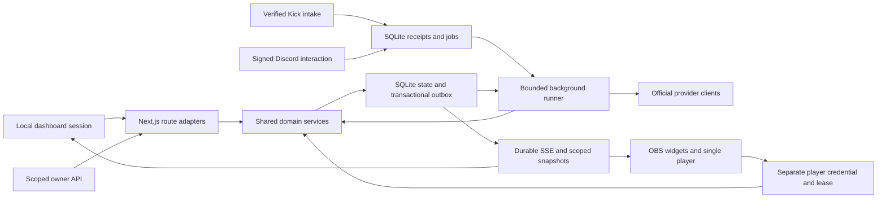

# KekBot architecture decisions

Updated: 2026-10-09. Status: foundation live gate passed historically; evaluation beta published; full-product live/stable acceptance pending. The beta 3 candidate packages the merged host launcher; published beta 1/2 artifacts remain immutable. Database schema 3 and backup/configuration format 1 are unchanged.

This is the design reference for contributors. Use [installation](INSTALLATION.md) for deployment, [configuration](CONFIGURATION.md) for runtime inputs, and [contributing](../CONTRIBUTING.md) for the source map/workflow. Return to the [documentation index](README.md).

<!-- contents:start -->
**On this page**

- [Runtime map](#runtime-map)
- [ADR 001 — One self-hosted application](#adr-001--one-self-hosted-application)
- [ADR 002 — SQLite is authoritative](#adr-002--sqlite-is-authoritative)
- [ADR 003 — Explicit runtime lifecycle](#adr-003--explicit-runtime-lifecycle)
- [ADR 004 — Authentication and provider trust](#adr-004--authentication-and-provider-trust)
- [ADR 005 — Web interfaces and media recovery](#adr-005--web-interfaces-and-media-recovery)
- [ADR 006 — Local module state and portable configuration](#adr-006--local-module-state-and-portable-configuration)
- [Host lifecycle boundary](#host-lifecycle-boundary)
- [References](#references)
- [Schema 3: long-lived state and focused views](#schema-3-long-lived-state-and-focused-views)
<!-- contents:end -->

## Runtime map

The proxy terminates public HTTPS; the application owns authorization/signature checks. SQLite is the source of truth, not React state or a browser connection. A provider acknowledgement establishes an external result; a local queued decision alone cannot do so. Each ADR below records the consequences of that choice.

| Boundary | Entry points | Invariant |
| --- | --- | --- |
| HTTP/UI | `src/app/api`, dashboard/module panels | Validate input/authority; delegate decisions; return uncached sanitized state |
| Shared state | `domain/catalog.ts`, `domain/state.ts`, `control.ts` | Bounded strict configuration, current capabilities, versions and audited transitions |
| Modules | Automation, moderation, media, engagement, presentation, operations services | Same decisions regardless of dashboard, chat, Discord or API caller |
| Durable work | `runtime.ts`, `storage/repository.ts` | Bounded batches/leases; atomic receipt/outbox; explicit uncertain effects |
| External services | `providers/` | Fixed trusted hosts, original-byte signature inputs, timeouts and safe retry classification |
| Maintenance | `cli.ts`, `maintenance.ts` | Exclusive stopped-host storage changes; integrity/key/schema validation |

See [HTTP contracts](API.md), [action payloads](API_ACTIONS.md) and [field schemas](CONFIGURATION_FIELDS.md) before changing an interface.

## ADR 001 — One self-hosted application

Use one pnpm project and a single long-running Node.js 24 runtime. Next.js App Router owns React presentation and HTTP routing. Provider clients, domain services, persistence, and jobs are separate TypeScript modules under `src/server`. No Redis, PostgreSQL, remote object storage, external worker, or multi-customer model is introduced.

The application uses digest-pinned official Node 24.21.0 Alpine 3.24 build stages and a shell-free runtime assembled into an empty root. Only Node, musl, libgcc and libstdc++ are shipped alongside standalone application output. The actual apk package database remains intact for vulnerability scanning. The image runs as UID/GID 1000, uses Node's bundled trust store and keeps data in `/data`. See [runtime image](RUNTIME_IMAGE.md) for compatibility, maintenance and notices.

The builder retains the pinned pnpm/native compilation toolchain. The runtime has no shell, package manager or image optimizer; maintenance invokes `node src/cli.ts`. Caddy 2.11.6 is compiled from locked Go modules with Go 1.27.2 and x/net 0.60.0. Linux CI exercises TLS/SSE, restart, storage/recovery and both installer formats. Production support starts with Linux x86-64/local disk, one application replica and operator-controlled public HTTPS with the direct application port bound to loopback.

## ADR 002 — SQLite is authoritative

Use better-sqlite3 with Drizzle ORM and checked-in SQL migrations. Enable foreign keys, WAL, synchronous FULL, and a bounded busy timeout. Transactions never contain network waits. Unique receipt/action IDs suppress duplicate local transitions; incoming receipts and jobs commit together. Local transitions and pending effects commit together.

Job state is pending/running/succeeded/failed/uncertain. Leases recover abandoned local work; abandoned outbound sends become uncertain because the provider may have accepted them. Only explicit rate-limit responses are automatically retried, with bounded delay and attempt count. Do not promise exactly-once external delivery.

An instance lease prevents a second runtime or offline maintenance process from operating concurrently. It renews every five seconds independently of provider I/O. A dead instance lease expires within 30 seconds; startup waits for its expiry. Multiple replicas/network-filesystem SQLite remain unsupported.

Use a real SQLite backup snapshot, not a copy of a live WAL database. Backups require the application to be stopped and include local assets/checksums. Restore validates schema, mode, original key fingerprint, database integrity, and asset hashes before publishing to new storage. Never overwrite an existing installation during restore; follow [backup/recovery ordering](BACKUP_RECOVERY.md).

## ADR 003 — Explicit runtime lifecycle

Next.js instrumentation imports Node-only bootstrap code when `NEXT_RUNTIME=nodejs` and `KEKBOT_RUN_JOBS=1`. A process-global runtime singleton prevents duplicate runner initialization. Processing is bounded to 50 jobs or 200 ms of elapsed batch time, checked between jobs, then yields for 100 ms. An in-flight bounded provider request can exceed that elapsed budget; independent lease/heartbeat renewal continues during asynchronous I/O. Completion and its audit/live events commit together. No HTTP request or browser tab owns the scheduler.

The build wrapper forces `KEKBOT_RUN_JOBS=0` and disables framework telemetry. Runtime data/secret paths are excluded from standalone tracing. Production startup uses manual signal handling for graceful lease release. Development fixtures use their own data directory and signing key and reject live credentials before any provider operation.

## ADR 004 — Authentication and provider trust

Normal operator access uses Argon2id local accounts, revocable database sessions, same-origin JSON/CSRF checks and one-time host-token owner setup. Invitations expire and can be used once. Owner/Admin/Moderator/Read-only powers are checked at server entry points and in shared domain services. Queued human/API/Discord actions recheck their authority before execution. Retained proof endpoints are explicitly opt-in and require owner sessions in live mode. OAuth also binds state to an HttpOnly, SameSite browser cookie. Tokens and PKCE material use AES-256-GCM with purpose-specific authenticated data; the encryption key lives outside the database and backup.

Node 24's built-in asynchronous Argon2id uses 64 MiB / three passes / one lane with a unique salt, and hashing concurrency is bounded. Widget reads, player acknowledgements and owner API tokens have separate hashed, revocable authority. API tokens are scoped and cannot manage secrets or accounts. Account secrets never enter public state.

Kick requests use fixed official hosts with redirects rejected and timeouts bounded. Verification uses the original request bytes and a key from the trusted Kick endpoint, never a caller header. Intake accepts documented chat/follow/stream and subscription variants for the configured broadcaster only. Its provisional signed-timestamp window is 48 hours with five minutes of future tolerance, based on documented retries extending beyond a day; live retry observations must confirm or revise this before release.

## ADR 005 — Web interfaces and media recovery

Use Next.js route handlers with uncached operational responses. Authenticated SSE uses durable IDs, bounded replay and snapshot recovery; active sessions/source tokens are rechecked. Browser, signed Discord, verified Kick and scoped owner API actions call shared domain services. Discord interaction tokens are encrypted in durable jobs and never retained in receipt bodies.

Media preserves the current item/queue after restart, pauses until moderator resume, then restarts the item from the beginning. Only one active player lease can acknowledge completion. Stale/disconnected players never advance a newer item.

## ADR 006 — Local module state and portable configuration

Schema 2 adds explicit account/session/token, queue, ledger/redemption, participation, incident, observation, audit and SSE tables. Declarative module configuration uses validated, versioned documents; internal ephemeral state uses bounded settings records. The checked-in schema 1→2 migration preserves foundation records and refuses upgrades while another runtime owns the lease.

Media decisions and player acknowledgements use optimistic versions inside short transactions. Points are an append-only ledger, vote/entry identities are unique, and raffle selection uses cryptographic randomness with audited rerolls. Moderation rules are bounded string/window evaluations; templates, themes and imports execute no caller code. Incoming stream timestamps prevent stale status transitions.

Analytics count only observed events, distinguish viewer samples from totals and expose missing worker coverage. Retention never deletes balances or pending queue decisions. Owner privacy actions state which integrity identifiers remain. Support bundles omit host/credential/raw-history data. Native configuration exports include validated asset bytes and remapped references, exclude authority/secrets/private history, and apply database changes atomically; failed imports clean up newly created assets. A process crash during file creation can leave an unreferenced asset for host inspection, without installing uncommitted configuration.

Current module/service interfaces and operator workflows are documented in [API.md](API.md) and [OPERATIONS.md](OPERATIONS.md). [TESTING.md](TESTING.md) covers failure/concurrency/browser/container campaigns; [LIVE_ACCEPTANCE.md](LIVE_ACCEPTANCE.md) covers real-provider and operational evidence. [MILESTONES.md](MILESTONES.md) separates implementation, automated, live and release gates.

## Host lifecycle boundary

The [Bash launcher](LAUNCHER.md) is a host entry, separate from the application image. It checks prerequisites, offers explicitly confirmed Ubuntu package assistance and stages only allowlisted regular Git blobs from one resolved management-tool commit. No downloaded management code executes before exact-source trust; local code needs explicit local trust and ordinary installed management verifies protected root ownership/paths. It then delegates to the existing Python wizard. Tool and application identities are independent. Branch/PR/source/image choices share the same domain-free lifecycle engine; no unattended upgrades or implicit manager replacement are introduced. New installations retain the launcher with copied tools; application updates preserve the existing manager.

The [guided host tool](INSTALLER.md) is dependency-free Python 3.10+ outside the Next.js runtime. Its numbered UI owns explanations/cancellation/typed review; its engine resolves source once, verifies bundles and immutable image metadata, and generates private Compose/environment/record files in an exclusively managed root. Host/root authority is separate from application roles. The tool does not automate provider consent or accept credentials through terminal arguments.

Updates stage images before downtime, persist a checkpoint, use the old image for a stopped-host backup and persist migration intent before invoking the new CLI. Linux `flock` serializes management operations; the application retains its independent SQLite runtime lease. Atomic private record writes are flushed before replacement. Failed migrations/startup require explicit recovery; rollback restores into new storage with the original key and old image rather than downgrading newer storage. Default uninstall retains files/certificates; purge requires typed review and rejects link/mount escapes. See [implementation](../installer/README.md) and [tests](TESTING.md).

Proxy preparation finishes before a fresh installation creates its managed record. Install/update/rollback failure cleanup attempts shutdown independently of record-write success, including failure to persist final activation. Container removal preserves incomplete operation status and recovery checkpoints; it cannot make failed data eligible for Start or another Update.

## References

For a new capability, add its shared domain decision first, then the required route/chat/Discord adapters. Test revoked authority during deferred execution, duplicate receipts, contention and failure classification. Keep provider calls outside transactions. Add only the feature's required checked-in migration, and update operator/API/recovery guidance with the change. A new screen alone does not satisfy a milestone.

- [Next.js self-hosting](https://nextjs.org/docs/app/guides/self-hosting)
- [Startup instrumentation](https://nextjs.org/docs/app/api-reference/file-conventions/instrumentation)
- [Standalone output and file tracing](https://nextjs.org/docs/app/api-reference/config/next-config-js/output)
- [Kick OAuth](https://docs.kick.com/getting-started/generating-tokens-oauth2-flow)
- [Kick webhook security](https://raw.githubusercontent.com/KickEngineering/KickDevDocs/main/events/webhook-security.md)
- [Kick API contract](https://api.kick.com/swagger/doc.yaml)
- [SQLite WAL](https://www.sqlite.org/wal.html)
- [better-sqlite3 backup API](https://github.com/WiseLibs/better-sqlite3/blob/master/docs/api.md)

## Schema 3: long-lived state and focused views

Migration `0002_retention_and_history.sql` adds job payload state/expiry/viewer associations, temporary-setting expiry/job references and retention/history indexes. It leaves released migrations unchanged. New jobs inherit viewer identity from event processing; asynchronous media results carry the requester explicitly. Existing receipt/media records backfill identities where still available. If an old receipt is already gone, erasure cannot reconstruct that association; normal payload retention still applies.

Resolved payloads use chat retention separately from outcome metadata. Uncertain outbound effects are encrypted with the installation key and job-specific purpose, remain non-retryable, and are scrubbed on explicit reconciliation. Pending/running payloads remain available for processing. Expired temporary settings are ignored on reads and removed by maintenance, while pending/running/uncertain Discord work protects its result. Durable configuration, counters and participation decisions are not temporary settings.

The operational snapshot includes every active media item. Terminal history uses a separate authenticated keyset query ordered by creation time and ID, backed by an index. Dashboard modules live in focused typed panels; the media history request is abortable and uncached. Routes still call shared domain services and enforce current authorization.

Uncertain jobs and pending redemptions have independent bounded keyset views and 50-item first pages in the snapshot. They never rely on the latest-100 history lists for discoverability. Pagination grants read access only; reconciliation/fulfillment still checks current authority. Gift recipients inherit job associations alongside event actors; erasure recovers missing older associations from retained receipts before checking pending work and scrubbing payloads.

Successful Kick authorization advances a connection generation and detaches the old refresh flight. Stale refresh success/error paths cannot modify the new grant; flight cleanup only clears its own promise. Replacement imports rebuild the validated portable namespace within one transaction and advance retained IDs from their previous versions, preventing stale editors from reusing version 1.

Backup format stays 1. Restored schemas 1 and 2 require stopped-host initialization before current startup. Old code must never open schema-3 storage.
